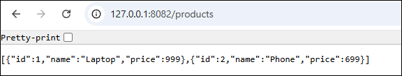

# Microservices Task - Kubernetes Deployment

This project demonstrates the deployment of a microservices architecture on Kubernetes using Minikube. The system consists of four services: User Service, Product Service, Order Service, and Gateway Service.

## Architecture Overview

- **User Service** (Port 3000): Handles user management operations
- **Product Service** (Port 3001): Manages product catalog
- **Order Service** (Port 3002): Processes order transactions
- **Gateway Service** (Port 3003): API gateway with proxy handling

## Prerequisites

- Docker Desktop installed and running
- Minikube installed
- kubectl installed
- curl or similar tool for testing

## Minikube Setup and Configuration

### 1. Start Minikube

```bash
# Start Minikube with Docker driver
minikube start --driver=docker

# Verify Minikube status
minikube status

# Enable necessary addons
minikube addons enable ingress
minikube addons enable dashboard
```

### 2. Configure kubectl Context

```bash
# Set kubectl context to minikube
kubectl config use-context minikube

# Verify cluster connection
kubectl cluster-info
```

### 3. Enable Docker Environment (Optional)

```bash
# Point Docker CLI to Minikube's Docker daemon
eval $(minikube docker-env)
```

## Deployment Process

### 1. Create Namespace

```bash
kubectl apply -f namespace.yml
```

### 2. Deploy Services

Deploy all services in the correct order:

```bash
# Deploy all services
kubectl apply -f services/user-service.yaml
kubectl apply -f services/product-service.yaml
kubectl apply -f services/order-service.yaml
kubectl apply -f services/gateway-service.yaml
```


### 3. Deploy Applications

```bash
# Deploy all deployments
kubectl apply -f deployments/user-service.yaml
kubectl apply -f deployments/product-service.yaml
kubectl apply -f deployments/order-service.yaml
kubectl apply -f deployments/gateway-service.yaml
```


### 4. Deploy All at Once (Alternative)

```bash
# Deploy everything in one command
kubectl apply -f .
```

## Validation and Testing

### 1. Check Pod Status

```bash
# Check all pods in the namespace
kubectl get pods -n mico-k8s

# Check pod details
kubectl describe pods -n mico-k8s

# Check pod logs
kubectl logs -n mico-k8s <pod-name>
```

Expected output:
```
NAME                              READY   STATUS    RESTARTS   AGE
gateway-service-xxxxxxxxx-xxxxx   1/1     Running   0          2m
order-service-xxxxxxxxx-xxxxx     1/1     Running   0          2m
product-service-xxxxxxxxx-xxxxx   1/1     Running   0          2m
user-service-xxxxxxxxx-xxxxx      1/1     Running   0          2m
```


### 2. Check Services

```bash
# List all services
kubectl get services -n mico-k8s

# Get service details
kubectl describe service <service-name> -n mico-k8s
```

### 3. Service Communication Testing

**Test Gateway Service (Main Entry Point):**
```bash
# Port-forward Gateway Service
kubectl port-forward -n mico-k8s service/gateway-service 8080:3003

# Test gateway endpoint (in a new terminal)
curl http://localhost:8080/
curl -v http://localhost:8080/api/users
curl -v http://localhost:8080/api/products
curl -v http://localhost:8080/api/orders
```

**Test Individual Services:**
```bash
# Port-forward User Service
kubectl port-forward -n mico-k8s service/user-service 8081:3000 &

# Port-forward Product Service  
kubectl port-forward -n mico-k8s service/product-service 8082:3001 &

# Port-forward Order Service
kubectl port-forward -n mico-k8s service/order-service 8083:3002 &

# Test individual services
curl http://localhost:8081/
curl http://localhost:8082/
curl http://localhost:8083/

# Stop port-forwarding (kill background processes)
pkill -f "kubectl port-forward"
```





## Troubleshooting Tips

### Common Issues and Solutions

#### 1. Pod Not Starting

```bash
# Check pod events
kubectl describe pod <pod-name> -n mico-k8s

# Check if images are available
kubectl get events -n mico-k8s --sort-by='.lastTimestamp'
```

#### 2. Service Discovery Issues

```bash
# Verify service endpoints
kubectl get endpoints -n mico-k8s

# Check DNS resolution
kubectl run dns-test --image=busybox -n mico-k8s --rm -it --restart=Never -- nslookup user-service
```

#### 3. Resource Issues

```bash
# Check resource usage
kubectl top pods -n mico-k8s
kubectl top nodes

# Check resource quotas
kubectl describe namespace mico-k8s
```

#### 4. Network Issues

```bash
# Test network connectivity between pods
kubectl exec -n mico-k8s <source-pod> -- ping <target-service>

# Check network policies
kubectl get networkpolicies -n mico-k8s
```

### Debugging Commands

```bash
# Get detailed cluster information
kubectl get all -n mico-k8s

# Check cluster events
kubectl get events -n mico-k8s --sort-by='.lastTimestamp'

# Restart deployment if needed
kubectl rollout restart deployment/<deployment-name> -n mico-k8s

# Scale deployment
kubectl scale deployment <deployment-name> --replicas=2 -n mico-k8s
```

## Cleanup

```bash
# Delete all resources in namespace
kubectl delete namespace mico-k8s

# Stop Minikube
minikube stop

# Delete Minikube cluster (optional)
minikube delete
```

## Screenshots and Evidence

### Required Screenshots:

1. **Running Pods**:
   ```bash
   kubectl get pods -n mico-k8s -o wide
   ```

2. **Service Communication Logs**:
   ```bash
   kubectl logs -n mico-k8s deployment/gateway-service --tail=50
   ```

3. **Port-Forward Test Results**:
   ```bash
   curl -v http://localhost:8080/health
   ```


## Additional Monitoring

### Dashboard Access

```bash
# Start Kubernetes dashboard
minikube dashboard

# Access dashboard URL (opens in browser)
```

### Resource Monitoring

```bash
# Enable metrics server
minikube addons enable metrics-server

# View resource usage
kubectl top pods -n mico-k8s
kubectl top nodes
```

## Project Structure

```
submission/
├── namespace.yml
├── services/
│   ├── user-service.yaml
│   ├── product-service.yaml
│   ├── order-service.yaml
│   └── gateway-service.yaml
├── deployments/
│   ├── user-service.yaml
│   ├── product-service.yaml
│   ├── order-service.yaml
│   └── gateway-service.yaml
└── README.md
```

## Notes

- All services use ClusterIP for internal communication
- Health probes are configured for reliable service management
- Resource limits and requests are set for optimal resource utilization
- Services are isolated within the `mico-k8s` namespace
- Docker images are pulled from `demoteam88` registry
